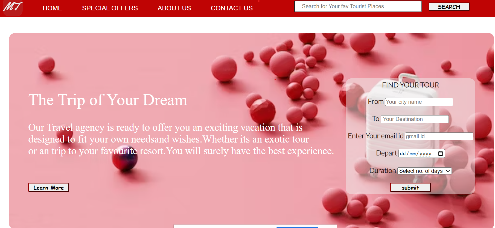

# Travellingsite
 
## html code for front page

* Here's my code to make frontpage [Frontpage code](code.txt)


Here's a frontpage view of my website





```Html
<!DOCTYPE html>
<html lang="en">

<head>
    <meta charset="UTF-8">
    <meta name="viewport" content="width=device-width, initial-scale=1.0">
    <title>MakeYourTrip-#Top rated platform</title>
    <link rel="shortcut icon" href="favicon.ico" type="image/x-icon">
    <link rel="stylesheet" href="styling.css">
    <link rel="stylesheet" href="utility.css">
    <link rel="stylesheet" href="exploredest.css">

</head>

<body>
    <header>


        <nav class="navigate">
            <div class="logo">
                
            </div>
            <ul>
                <li><a href="frontpage.html">HOME</a></li>
                <li><a href="">SPECIAL OFFERS</a></li>
                <li><a href="aboutus.html">ABOUT US</a></li>
                <li><a href="contactus.html">CONTACT US</a></li>
            </ul>
            <div class="search">
                <!-- <label for="Search">Search your Destinations</label> -->
                <input type="text" name="Search" id="" placeholder=" Search for Your fav Tourist Places">

                <button class="btn">SEARCH</button>
            </div>

            </div>

        </nav>
    </header>

    <div id="videofix">
        <!-- <video src="naturevideo.mp4" controls width="690px" loop></video> -->
    </div>
    <div class="form">
        <div class="piclines">
            <p id="one">The Trip of Your Dream</p>
            <p>Our Travel agency is ready to offer you an exciting vacation that is <br>designed to fit your own
                needsand wishes.Whether its an exotic tour <br>
                or an trip to your favourite resort.You will surely have the best experience.</p>
            <br><br>
            <button class="submitbtn">Learn More</button>
        </div>
        <div class="formcontent">
            <form action="">
                <caption>FIND YOUR TOUR</caption><br>
                <!-- <label for="name">Enter Your Name</label>
              <input type="text" name="" id="" placeholder="name"> -->
                <br>
                <label for="name">From </label>
                <input type="text" name="" id="" placeholder="Your city name">
                <br><br>
                <label for="name">To</label>
                <input type="text" name="" id="" placeholder=" Your Destination">
                <br><br>
                <label for="name">Enter Your email id</label>
                <input type="email" name="" id="" placeholder="gmail id">
                <br><br>
                <label for="name">Depart</label>
                <input type="date" name="" id="" placeholder="choose date">
                <br><br>
                <label for="name">Duration</label>
                <select name="" id="">
                    <option value="">Select no. of days</option>
                    <option value="">1 night and 2 days</option>
                    <option value="">2 night and 3 days</option>
                    <option value="">3 night and 4 days</option>
                    <option value="">4 night and 5 days</option>
                    <option value="">5 night and 6 days</option>
                    <option value="">1 week or more</option>
                </select><br>

                <br><button class="submitbtn">submit</button>

            </form>
        </div>
    </div>
    <h2 id="topdest">Explore Top Destinations</h2>
    <br> <br>
    <div class="exploredestinations">
        <div class="destination1">
            <div class="border">
                <h3>India</h3>
                <p> 100 cities
                </p>
            </div>
        </div>
        <div class="destination2">
            <div class="border">
                <h3>Paris</h3>
                <p> 100 cities
                </p>
            </div>
        </div>
        <div class="destination3">
            <div class="border">
                <h3>Greece</h3>
                <p> explore
                </p>
            </div>
        </div>
        <div class="destination4">
            <div class="border">
                <h3>Canada</h3>
                <p> Niagara Falls
                </p>
            </div>
        </div>
    </div>
    <marquee behavior="alternate" direction="right to left">Book Your package with MakeYourTrip and avail 10% extra discount</marquee>
    <div class="exploredestinations">
        <div class="destination5">
            <div class="border">
                <h3>Dubai</h3>
                <p> 100 cities
                </p>
            </div>
        </div>
        <div class="destination6">
            <div class="border">
                <h3>Egypt</h3>
                <p> 100 cities
                </p>
            </div>
        </div>
        <div class="destination7">
            <div class="border">
                <h3>Maldives</h3>
                <p> explore
                </p>
            </div>
        </div>
        <div class="destination8">
            <div class="border">
                <h3>Bali</h3>
                <p>Visit Now
                </p>
            </div>
        </div>
    </div>
    <div class="megaoffer">
        <div class="megaofferlines">
            <h3 id="megahead"><u>Mega Offer</u></h3>
            <br>
            <h2>
                <h1>30%</h1> OFF For Family Vacation
            </h2>
            <!-- <h3>HURRY UP !!</h3> -->
            <!-- <h3>Grab The Offer</h3> -->

            <p id="term">T&C Apply</p>
        </div>
        <div class="megaofferform">
            <form action="">
                <h2>SIGN UP NOW</h2>

                <br>
                <input class="inputform" type="text" placeholder="Your name">
                <br><br>
                <input class="inputform" type="email" placeholder="Your email">
                <br><br>
                <select class="inputform" name="Destination" id="">
                    <option value="">SELECT DESTINATION</option>
                    <option value="">Andhra Pradesh</option>
                    <option value="">Arunachal Pradesh</option>
                    <option value="">Goa</option>
                    <option value="">Gujarat</option>
                    <option value="">Haryana</option>
                    <option value="">Himachal Pradesh</option>
                    <option value="">Jammu and Kashmir</option>
                    <option value="">Kerala</option>
                    <option value="">Meghalaya</option>
                    <option value="">Maharashtra</option>
                    <option value="">Rajasthan</option>
                    <option value="">Tamil Nadu</option>
                    <option value="">Uttarakhand</option>
                    <option value="">West Bengal</option>
                    <option value="">Andaman and Nicobar Islands</option>
                    <option value="">Delhi</option>
                    <option value="">Ladakh </option>
                    <option value="">Lakshadweep</option>
                    <option value="">Madhya Pradesh</option>
                    <option value="">Chandigarh</option>
                </select><br><br>
                <button type="button" class="submitbtn">SIGNUP</button>
            </form>
        </div>
    </div>
    <div class="refund">
        <div class="refundlines">
            <h2>Full Refund</h2>
            <p>Due to any medical reasons, according to our terms and conditions ,<br>
                after you submit us with proper
                medical <br>Refund will be provided to the account provided <br>100% refund would be provided to you.
                <br> REFUND WITHIN 10 DAYS ONLY !!
            </p>
        </div>
    </div>
    <div class="whybooking">
        <div class="whybook">
            <h2 class="h2book">Why Book With US ?</h2>
            <div class="backimage">
                <div class="photo">
                    
                    <div class="descrip">
                        <p class="heading"><b>Easy Booking</b></p>

                    </div>
                </div>


                <div class="photo">
                    
                    <div class="descrip">
                        <p class="heading"><b>Lowest Price</b></p>

                    </div>
                </div>


                <div class="photo">
                    
                    <div class="descrip">
                        <p class="heading"><b>Exciting Deals</b></p>

                    </div>
                </div>


                <div class="photo">
                    
                    <div class="descrip">
                        <p class="heading"><b>24/7 Support</b></p>

                    </div>
                </div>
            </div>
        </div>
    </div>
    <div class="lowerfooter">
        <div class="container" id="whymake">
            <p>
                <b>Why MakeYourTrip</b>
                <br>
                Established in 2023, MakeYourTrip has since positioned itself as one of the leading companies,
                providing great offers, competitive airfares, exclusive discounts, and a seamless online booking
                experience to many of its customers. The experience of booking your flight tickets, hotel stay, and
                holiday package through our desktop site or mobile app can be done with complete ease and no hassles
                at all. We also deliver amazing offers, such as Instant Discounts, Fare Calendar, MyRewardsProgram,
                MyWallet, and many more while updating them from time to time to better suit our customers’ evolving
                needs and demands.
            </p>
        </div>
        <div class="container" id="booking">
            <p>
                <b>Booking Flights with MakeYourTrip</b><br>
                At MakeyourTrip, you can find the best of deals and cheap air tickets to any place you want by booking
                your tickets on our website or app. Being India’s leading website for hotel, flight, and holiday
                bookings, it helps you book flight tickets that are affordable and customized to your
                convenience. With customer satisfaction being our ultimate goal, we also have a 24/7 dedicated
                helpline to cater to our customer’s queries and concerns. Serving over 5 million happy customers, we
                at MakeYourTrip are glad to fulfill the dreams of folks who need a quick and easy means to find air
                tickets. You can get a hold of the cheapest flight of your choice today while also enjoying the
                other available options for your travel needs with us.
            </p>
        </div>
    </div>

    <!-- <div class="container">  -->
    <!-- <p> -->
    <!-- <b>Domestic Flights with MakeMyTrip</b> -->
    <!-- MakeMyTrip is India's leading player for flight bookings. With the cheapest fare guarantee, experience great value at the lowest price. Instant notifications ensure current flight status, instant fare drops, amazing discounts, instant refunds and rebook options, price comparisons and many more interesting .isit all major cities of India buying cheap domestic flight tickets at EaseMyTrip.com. We display widest network of airlines traveling on different Indian cities and assure you a memorable journey. Book any domestic flight with EaseMyTrip.com and get up to Rs.500 Off. Use promotion code EMT2022 and then compare airfare for anywhere. So, leave all your worries behind and plan a memorable trip with domestic flights at EaseMyTrip.com. -->


    <!-- </p> -->
    <!-- </div> -->

    <footer>
        <div id="footers">
            <p class="copyright">CopyRight &copy;TourismIndustry<br>
                MAKE YOUR TRIP PVT.LTD</p>
        </div>
    </footer>


</body>

</html>


```